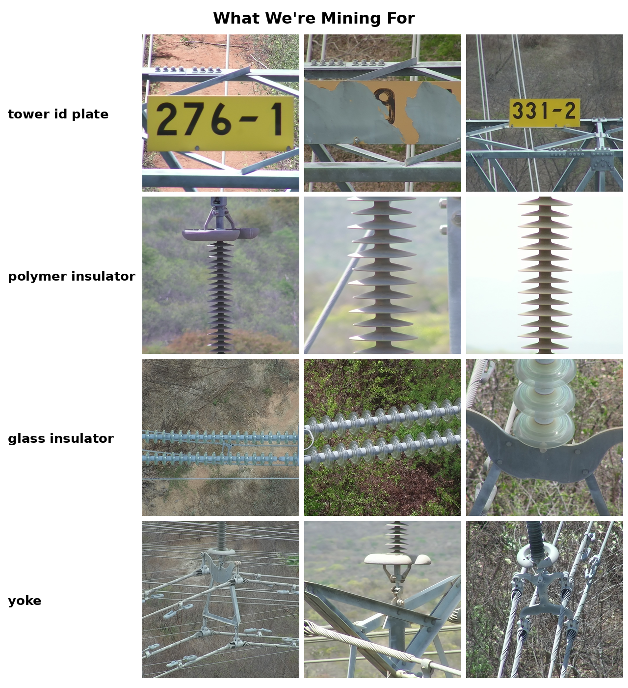

# Cold Pool to Hot Queue: Take-Home Pipeline

This is the exact code that runs live at the "Cold Pool to Hot Queue" workshop. Same scripts, same seed, same dataset; nothing here is a simplified stand-in. Run Steps 1 through 4 in order, then stop writing setup code and go work in the FiftyOne App in your browser. That's where the actual workshop (embed, compress, map, search, prioritize, annotate, fine-tune, review) happens. Step 5 is optional disk cleanup, and Step 6 only runs at the very end, once you're ready to evaluate.

**The point of this workshop:** deciding *which* images deserve a human's attention is the hard part, not fine-tuning the model. Steps 1 through 4 build the "cold start," a real pool of unlabeled UAV photos, so you can practice that decision yourself, live, in the App.

**New to FiftyOne?** The companion [blog post](../annotation_in_fiftyone.md) opens with a 30-second primer on the core vocabulary, dataset, sample, field, view, and it's worth reading before you start if any of those terms are unfamiliar. Everything below assumes you already know what those words mean.

Here's what you're annotating for: four classes, deliberately balanced to roughly the same size, none labeled yet in the pool you're about to build.



## Fast path: skip straight to the pool

Don't want to run the download/sample/stage pipeline yourself? The finished pool is already on Hugging Face Hub:

```python
import fiftyone as fo
from fiftyone.utils.huggingface import load_from_hub

dataset = load_from_hub("harpreetsahota/InsPLAD-workshop-pool")
session = fo.launch_app(dataset)
```

That's the identical 1,754-image, media-only dataset these five scripts build. Skip to "This is where the scripts stop and the workshop starts" below. Otherwise, keep reading; running the pipeline yourself is the point if you want to see exactly how a 10,561-image source dataset becomes a 1,754-image balanced workshop pool.

## Before you start

- Python environment with `fiftyone`, `requests` installed
- ~11 GB free disk space at peak (6.4 GB zip + 4.2 GB extracted source), droppable to ~200 MB after cleanup (step 5, optional)
- No GPU needed for any of these five steps: they're pure I/O and JSON parsing
- License note: [InsPLAD](https://github.com/andreluizbvs/InsPLAD) is CC BY-NC 3.0, non-commercial use only. This pipeline and the resulting pool inherit that license.

## Step 1: Download the source dataset

```bash
python 01_download_insplad_det.py
```

**What it does:** Queries the Mendeley API for the current download URL (avoids hardcoding a link that can rotate), downloads InsPLAD's single 6.4 GB outer zip with resume support, then extracts *only* the `InsPLAD-det.zip` inner archive, the detection sub-dataset of whole UAV scene images. The other two inner zips (`supervised_fault_classification.zip`, `unsupervised_anomaly_detection.zip`) stay untouched inside the outer zip; this workshop doesn't use cropped images, only full scenes.

**You should see:** `Done. 10561 images available under data/InsPLAD-det` (train + val splits combined).

## Step 2: Build the workshop pool manifest

```bash
python 02_build_workshop_pool.py
```

**What it does:** InsPLAD-det's full 10,561 images are too many to browse meaningfully in one sitting, but a naive random subsample breaks the workflow. Dedupe first and there's no duplicate wall left to find; subsample first and the class balance in the raw data (`tower id plate` has only 242 images total, some other classes have thousands) carries straight through into an unbalanced pool. Instead, this script builds a **deterministic, balanced stratified sample** (seed=51, so you'll get the identical 1,754 images every time you run it):

| Tier | What it keeps | Why | Images |
|---|---|---|---|
| 0. Eval holdout | 25/class, carved out FIRST, before any other tier | A clean, never-touched benchmark held back from every interactive step, see below | 100 |
| 1. Balanced annotation targets | Capped per-flight samples of all 4 target classes (`tower id plate` ~214, `polymer insulator`/`glass insulator`/`yoke` ~217 each) | `tower id plate`'s natural ceiling of 242 images sets the quota for every class, so none dominates the annotation budget | 865 |
| 2. Duplicate-wall flights | 14 whole drone flights, every frame | Real, contiguous near-duplicate sequences for the "compress" step, not staged | 574 |
| 3. Long-tail texture | 1 image per remaining flight | Keeps the embedding plot's messy middle looking like a messy middle | 215 |

These four tiers sum to the full 1,754 images in the manifest. The 100 eval-holdout images are tagged `eval_holdout` at import time (Step 4) and excluded from every interactive step, so the true interactive pool at any point is 1,654 images.

**You should see:** `Total workshop pool size: 1754`, plus a per-tier breakdown printed to the console. The manifest is written to `data/workshop_pool_manifest.json`; it records exactly which files were picked and why, so the whole pipeline is auditable.

**Want to try different numbers?** The constants at the top of the script (`N_DUP_WALL_FLIGHTS`, `TARGET_CLASSES`, `EVAL_HOLDOUT_PER_CLASS`, `TARGET_CLASS_QUOTA`, `TARGET_CLASS_PER_FLIGHT_CAP`) are the knobs. Change one, rerun, and the manifest updates deterministically.

## Step 3: Stage the pool and hold out the real labels

```bash
python 03_stage_pool_and_heldout_labels.py
```

**What it does:** Copies the 1,754 manifest images into a lean `data/workshop_pool/` folder (so step 4's import doesn't need the full 4.2 GB `InsPLAD-det/` folder around). Separately, it converts InsPLAD's original COCO boxes to FiftyOne's relative `[x, y, w, h]` format for those same 1,754 images and writes them to `data/heldout_ground_truth.json`. This file is **never loaded into the working FiftyOne dataset**. It's the answer key, reserved for the very last "close the loop" step, after you've searched and annotated the pool yourself.

**You should see:** `Staged 1754 images to data/workshop_pool` and `Held-out ground truth for 1754 images saved to data/heldout_ground_truth.json`.

## Step 4: Import into FiftyOne, media-only

```bash
python 04_import_workshop_dataset.py
```

**What it does:** Creates a persistent FiftyOne dataset named `insplad-workshop-pool` from the staged images. No label fields are attached; this is a genuine cold start, not a simulated one. One tag *is* applied at import time, `eval_holdout`, on the 100 samples the manifest carved out in Step 2, but tagging isn't labeling: it just marks which samples are off-limits for annotation, search, and training, without revealing what's actually in them. It launches the FiftyOne App at the end.

**You should see:** `Imported <N> images into 'insplad-workshop-pool' (media-only, no labels)`, then the App opens in your browser.

**This is where the scripts stop and the workshop starts.** From here, work in the App, in this order:

1. Browse the pool, get oriented. Zero label fields exist yet, confirm that for yourself in the sidebar.
2. Compute a CLIP embedding for every image, one call, reused by every step below.
3. Find and tag near-duplicates using that embedding, before spending any human attention on a pool that has repeats baked in.
4. Visualize the pool in 2D with UMAP, lasso whatever clusters stand out, and compute `uniqueness` + `representativeness` while you're looking, both are free once the embedding exists.
5. Try a plain-text search for a class first; it's free, and sometimes it just works. Then search harder with a few labeled examples instead of a word, either `sort_by_similarity()` in code or the zero-code [Crop Query](https://github.com/harpreetsahota204/crop_query) panel (`fiftyone plugins download https://github.com/harpreetsahota204/crop_query`), which also localizes the match with a heatmap.
6. Optionally cross-check with a second embedding backbone (C-RADIO), which sees different internal structure than CLIP in some classes.
7. Prioritize whatever the search step didn't already find by blending `uniqueness` and `representativeness` into one triage score, then annotate that hot queue natively in the App, into a `human_annotated` field (never `ground_truth`, that name is reserved for the holdout you haven't seen yet).
8. Fine-tune a detector on `human_annotated`, directly from the App's action menu.
9. Run that checkpoint back over the full pool: mistakenness-sort against `human_annotated` catches your own labeling errors, confidence-sort on everything else previews the next annotation round.
10. Only then: run `python 08_reveal_eval_holdout_ground_truth.py` (Step 6 below) and evaluate against the real holdout.

If you already have your own FiftyOne dataset loaded elsewhere, you can reload this one anytime with:

```python
import fiftyone as fo
dataset = fo.load_dataset("insplad-workshop-pool")
session = fo.launch_app(dataset)
```

## Step 5: Clean up (optional)

```bash
python 05_cleanup_unused_images_OPTIONAL.py
```

**What it does:** Interactively offers to delete the 6.4 GB outer zip and/or the 4.2 GB full `InsPLAD-det/` extract, now that `data/workshop_pool/` has everything the FiftyOne dataset actually needs. Refuses to run if `workshop_pool/` looks empty, so you can't accidentally delete your only copy of the source data before it's safely staged. Keep the full extract around if you want to rerun step 2 with different sampling parameters later.

## Step 6: Reveal the eval holdout and close the loop

(This script is numbered `08_`, not `06_`. Scripts `06_seeded_search_all_classes.py` and `07_tag_potential_matches.py` are workshop-time search helpers you run from inside the App phase above, not part of this numbered setup pipeline, they just happen to share the same folder.)

```bash
python 08_reveal_eval_holdout_ground_truth.py
```

**What it does:** This is the one script that isn't meant to run early. It loads the real boxes from `data/heldout_ground_truth.json` into a `ground_truth` field, strictly scoped to the 100 samples tagged `eval_holdout` (everything else in the pool keeps zero label fields) and to just the 4 classes this workshop targets. InsPLAD-det's source annotations carry 11 fine-grained classes; the other 7 (shackle variants, `stockbridge damper`, `yoke suspension`) get dropped rather than loaded, since a model that was only ever trained on 4 classes shouldn't be scored as if it missed the other 7. It also saves an `eval_holdout_annotated` view so those 100 annotated samples are a click away in the App from then on.

**You should see:** `ground_truth populated on 100/100 eval_holdout samples` and `Saved view 'eval_holdout_annotated' created.` From there, run your fine-tuned checkpoint over `dataset.load_saved_view("eval_holdout_annotated")` and call `evaluate_detections("predictions", gt_field="ground_truth")` for a real, uncontaminated generalization number.

## Why these numbers

Full details on where 10,561 (the source) and 1,754 (this pool) come from, and why every class is capped at roughly the same quota, are in the companion [blog post](../annotation_in_fiftyone.md) and [`TALK_BRIEF.md`](../TALK_BRIEF.md).
